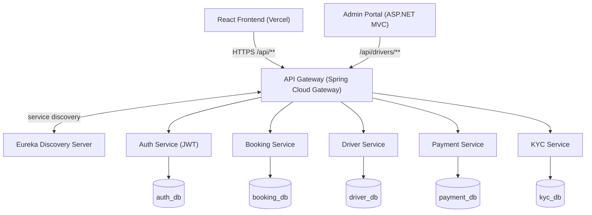

# HerWayCabs 🚕

A production-style, cloud-native **cab-booking platform built for women riders and women drivers**. HerWayCabs is a Spring Boot microservices system fronted by a React SPA, deployed on **Render** (backend) and **Vercel** (frontend), with a **per-service PostgreSQL database on Neon**.

> A full-stack microservices showcase — API Gateway, service discovery, JWT auth, polyglot services, and independent Docker deployments.

---

## Live demo

| Component | URL |
|---|---|
| Frontend (React) | https://herwaycabs-deploy.vercel.app |
| Admin Portal (ASP.NET) | https://herwaycabs-admin-portal.onrender.com |
| API Gateway | https://herwaycabs-api-gateway.onrender.com |
| Eureka dashboard | https://herwaycabs-discovery.onrender.com |

> ⚠️ The backend runs on Render's **free tier**, so services spin down after ~15 min idle and can take up to a minute to cold-start on first request. A keep-alive workflow mitigates this; for a smooth demo, open the Eureka dashboard first to warm the mesh.

---

## Features

- **Ride lifecycle** — request → driver match → OTP‑verified start → complete → payment (simulated) → rating.
- **Live driver tracking** — the rider sees the assigned driver move on the map with a live ETA.
- **Ratings** — riders rate drivers (1–5 + note) after a trip; a driver's average shows on the ride card, history, and admin.
- **Busy state** — a driver is marked unavailable while on a trip and freed when it completes or cancels.
- **Women‑only** — sign‑up is gated to female users by design; drivers must be admin‑verified before going online.
- **Accounts** — JWT auth, editable **profile**, **change password**, a **forgot/reset‑password** flow, and **KYC** document upload.
- **Ride history** — searchable, filterable history for riders and drivers.
- **Admin console** — driver verification plus drivers / users / rides views with search, filters & pagination.

## Architecture



Every backend service registers with **Eureka** and is reachable only through the **API Gateway** (`lb://SERVICE-NAME`). The frontend never talks to services directly — always through the gateway.

---

## Services

| Service | Stack | Port | Responsibility |
|---|---|---|---|
| Discovery Server | Spring Cloud Netflix Eureka | 8761 | Service registry |
| API Gateway | Spring Cloud Gateway | 8080 | Single entry point, routing, CORS |
| Auth Service | Spring Boot + Spring Security + JWT | 8081 | Register / login / JWT issuance |
| Booking Service | Spring Boot + JPA | 8082 | Ride lifecycle (request → assign → start → complete → pay) |
| Payment Service | Spring Boot + Razorpay | 8083 | Payments (runs in mock mode without keys) |
| Driver Service | Spring Boot + JPA | 8084 | Drivers, availability, verification, documents |
| KYC Service | Spring Boot + JPA | 8085 | Document upload / verification |
| Admin Portal | ASP.NET Core 8 MVC (C#) | 8080 | Admin console — driver verification, drivers / users / rides views with search, filters & pagination (cookie auth, ADMIN-only) |
| Frontend | React 19 + Vite + Tailwind + Leaflet | 5173 | Rider / Driver / Admin UI |

---

## Tech stack

- **Backend:** Java 17, Spring Boot 3.2, Spring Cloud 2023, Spring Cloud Gateway, Netflix Eureka, OpenFeign, Spring Security + JWT, JPA/Hibernate
- **Frontend:** React 19, Vite, React Router, Axios, TailwindCSS, Leaflet + OpenStreetMap
- **Admin Portal:** ASP.NET Core 8 MVC
- **Data:** PostgreSQL on Neon — one database per service
- **Infra:** Docker (per service), Render (backend), Vercel (frontend), GitHub Actions (keep-alive)

---

## Repository layout

```
├── microservices/
│   ├── discovery-server/     # Eureka
│   ├── api-gateway/          # Spring Cloud Gateway
│   ├── auth-service/         # JWT auth
│   ├── booking-service/
│   ├── driver-service/
│   ├── payment-service/
│   ├── kyc-service/
│   └── admin-portal/         # ASP.NET Core MVC
├── frontend/                 # React + Vite SPA
├── .github/workflows/        # keep-alive.yml
└── docker-compose.yml
```

---

## Running locally

**Prerequisites:** Java 17 + Maven, Node 18+, and a PostgreSQL database (local, or point at Neon).

**Backend** — start in order: `discovery-server` → `api-gateway` → the domain services:

```bash
cd microservices/<service>
DB_URL=jdbc:postgresql://localhost:5432/<db> \
DB_USERNAME=postgres DB_PASSWORD=postgres \
EUREKA_URL=http://localhost:8761/eureka \
mvn spring-boot:run
```

**Frontend:**

```bash
cd frontend
echo "VITE_API_URL=http://localhost:8080" > .env
npm install
npm run dev
```

---

## API (through the gateway)

| Method | Path | Service |
|---|---|---|
| POST | `/api/auth/register` | Auth |
| POST | `/api/auth/authenticate` | Auth |
| GET  | `/api/auth/profile` | Auth (current user) |
| PUT  | `/api/auth/profile` | Auth (update name / phone) |
| POST | `/api/auth/change-password` | Auth (current + new password) |
| POST | `/api/auth/forgot-password` | Auth (issue reset token) |
| POST | `/api/auth/reset-password` | Auth (reset via token) |
| GET  | `/api/auth/users` | Auth (admin listing, no password hashes) |
| GET  | `/api/bookings/available` | Booking |
| GET  | `/api/bookings/all` | Booking (all rides — admin ride history) |
| POST | `/api/bookings/request` | Booking |
| GET  | `/api/bookings/my-rides` | Booking (a rider's / driver's own ride history) |
| POST | `/api/bookings/{id}/rate` | Booking (rider rates the driver, 1–5 + note) |
| GET  | `/api/bookings/driver/{id}/rating` | Booking (a driver's average rating) |
| GET  | `/api/drivers` | Driver (all drivers) |
| GET  | `/api/drivers/available` | Driver |
| GET  | `/api/drivers/pending` | Driver |
| POST | `/api/drivers/register` | Driver (idempotent by email — used to self-heal the sign-up sync) |
| POST | `/api/drivers/{id}/verify` | Driver |
| POST | `/api/kyc/upload` | KYC |

> Registration requires `gender: "Female"` — the platform is women-only by design. Auth returns a JWT that the frontend stores and attaches (`Authorization: Bearer …`) on subsequent calls.

---

## Deployment

- Each backend service is a **Render Docker web service** (`Root Directory = microservices/<service>`, Dockerfile build, health check `/actuator/health`), with **`SPRING_PROFILES_ACTIVE=render`** so it registers in Eureka under its public `*.onrender.com` host on port 443 — letting the gateway route across services.
- The frontend is a **Vercel** project (`Root Directory = frontend`, `VITE_API_URL` → gateway URL). SPA routing via `frontend/vercel.json`.
- The **admin portal** is a Render Docker web service (`Root Directory = microservices/admin-portal`, .NET 8), with `ApiSettings:GatewayUrl` → `<gateway>/api`. It uses cookie authentication and only admits users with the **ADMIN** role. `ForwardedHeaders` is enabled so cookies work behind Render's HTTPS proxy.
- Databases are **Neon** PostgreSQL, one per service.
- **`.github/workflows/keep-alive.yml`** pings every service on a schedule to reduce free-tier cold starts.

---

## Roadmap

Planning → backend → cloud deploy → service integration → frontend deploy are complete. Upcoming: full OpenFeign inter-service calls, RabbitMQ async events, Redis caching, MinIO object storage for documents, WebSocket live driver tracking, observability (Prometheus/Grafana), CI/CD, and production hardening (rate limiting, circuit breakers, validation).

---

## License

Educational / portfolio project.
